# Text chat VP Extension with SkyWay
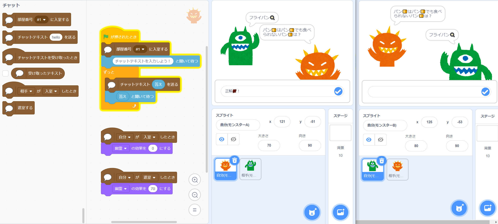

Version 0.5.0   

# Description | 説明
Simple 1-on-1 Text Chatting extension for VP with [SkyWay](https://skyway.ntt.com/ja/) by NTT.  
NTTの[SkyWay](https://skyway.ntt.com/ja/)を使ったVisual Programming向けのシンプルな2者間テキストチャット機能拡張モジュールです。 
> **Warning**  
> We are using old version of SkyWay.  
> 旧版のSkyWayを使っています。[最新版](https://skyway.ntt.com/ja/)ではないのでご注意ください。

# How to Use | 使い方
## 1. Getting API Key | APIキーを取得する
[こちらの手順](./api-key.md)で旧版SkyWayのAPIキーを取得してください。  
以下のようなIDのテキストが取得できますので、コピペできるようにご準備ください。
```
// API Key
12345678-abcd-ef12-3456-7890abcdef01
```

## 2. Loading extension | 拡張機能をロードする
以下のURLにある`js`ファイルを拡張機能として登録してください。
```
https://tetunori.github.io/vp-ext-textchat-skyway/dist/index.js
```

なお、拡張機能の登録方法はツール毎に異なるため、各サイトの指示に従ってください。  
`TurboWarp`や`E羊icques`については、以下の手順説明もご参照ください。
<details><summary>TurboWarpやE羊icquesでの詳細手順を見るにはこちらをクリック</summary>

### TurboWarpで登録する
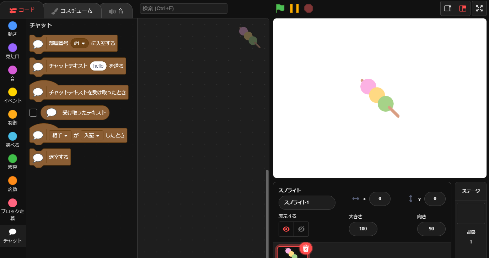

`TurboWarp`向けのライブラリは以下となります。
```
https://tetunori.github.io/vp-ext-textchat-skyway/dist/TurboWarp.js
```
ただし、`TurboWarp`はセキュリティのポリシー上、このライブラリをそのまま使うことはできません。一度ライブラリをダウンロードし、`localhost:8000`でserveしたものを読み取る事で初めて使うことができます。以下の手順でご確認ください。
1. [ライブラリファイル](https://github.com/tetunori/vp-ext-textchat-skyway/blob/main/dist/TurboWarp.js)(TurboWarp.js)をダウンロードする。
2. `http-server -p 8000` や `yarn localhost`(このリポジトリをCloneしている場合)等でダウンロードしたファイルをserveします。
3. [以下のURL](https://turbowarp.org/editor?extension=http://localhost:8000/dist/TurboWarp.js)にアクセスすればOKです。ファイルパスはご自分の環境に併せて変更してください。
```
https://turbowarp.org/editor?extension=http://localhost:8000/dist/TurboWarp.js
```

### E羊icquesで登録する
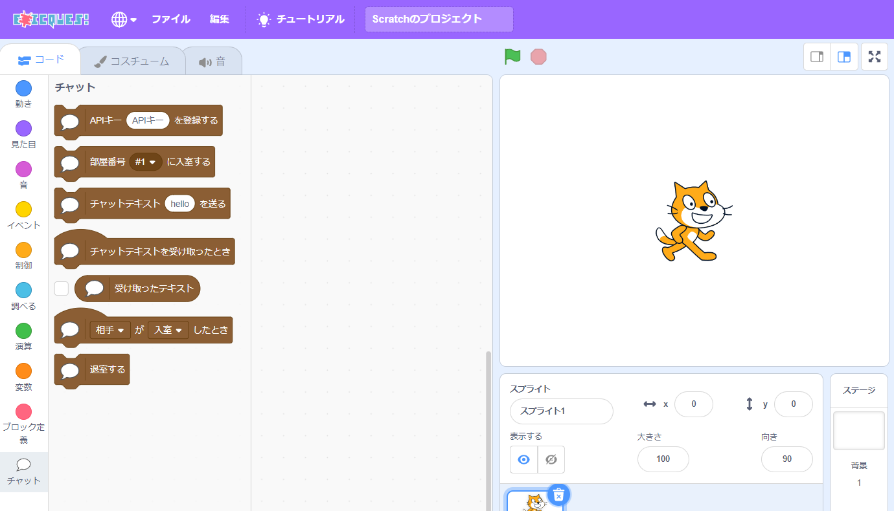

> **Warning**  
> 登録はできるのですが、その後不具合が見られるため、完全に動作できませんので、ご注意ください。

`E羊icques`向けのライブラリは以下となります。
```
https://tetunori.github.io/vp-ext-textchat-skyway/dist/Esheepicques.js
```
ただし、`E羊icques`のクエリを使って下記を渡してあげることで、拡張機能が展開された状態で表示することが可能です。
```
https://sheeptester.github.io/scratch-gui/?extension=https://tetunori.github.io/vp-ext-textchat-skyway/dist/Esheepicques.js
```
[E羊icquesのお試しリンク](https://sheeptester.github.io/scratch-gui/?extension=https://tetunori.github.io/vp-ext-textchat-skyway/dist/Esheepicques.js)
</details>

最初にAPIキーを入力するプロンプトが出るので、上記手順1.でコピーしたAPIキーを貼り付けて、`OK`ボタンを押してください。  
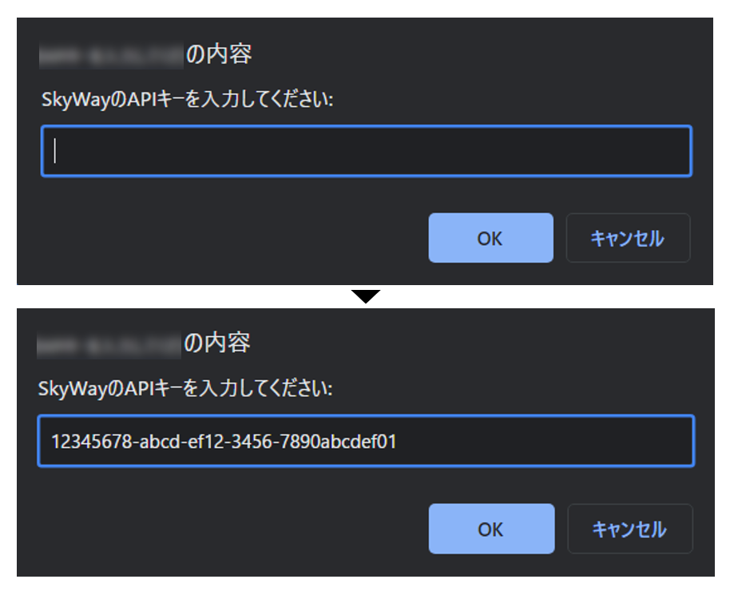

> **Note**  
> ここで誤ってプロンプトをキャンセルしたりてしまっても、後ほど入室時に再度入力できますので、ご安心下さい。なお、誤ったAPIキーを入力してしまった場合は、ページを更新して再度入力をやり直してください。

ブロックカテゴリの一番下に"チャット"が表示されれば、準備完了です。  
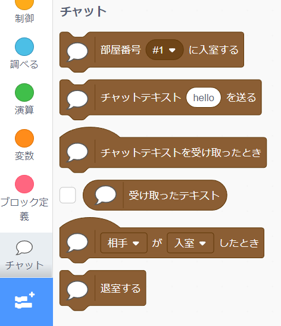

## 3. Chatting | チャットをする
Alice/Bobの２人でチャットをする流れとしては、以下の通りです。(Alice/Bobが逆の場合も同様です)
1. 双方で同じ部屋番号を指定して入室する
2. Aliceからチャットテキストを送る
3. Bobが受け取ったテキストを確認する

### 3-1. 入室する
AliceとBobの双方で、`部屋番号 <部屋番号テキスト> に入室する`ブロックの`<部屋番号テキスト>`部分を選択肢から選ぶか、お好きな文字を設定して、ブロックを実行してください。  
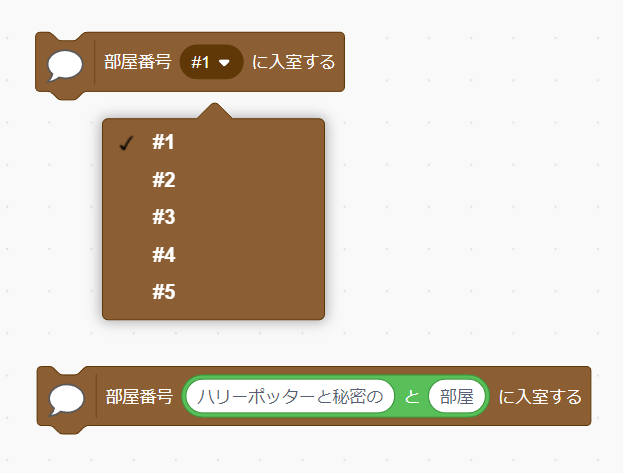

### 3-2. テキストを送る
双方で入室ができたら、AliceからBobにチャットテキストを送ってみましょう。  
Aliceのスクリプトの中で、`チャットテキスト <テキスト> を送る`ブロックの`<テキスト>`部分にお好きな文字列を入力して、ブロックを実行してください。  


### 3-3. 受信したテキストを見る
上記で送信が成功していれば、Bob側のスクリプトで`受け取ったテキスト`ブロックを実行することで、受信したテキストを確認できます。  
また、`チャットテキストを受け取ったとき`ブロックと組み合わせると使いやすくなります。  
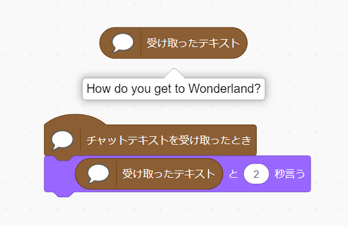

Bob → Aliceについても同様に対応することで、双方向の通信を実現することができます。以下のサンプルで確認してみましょう。

# Samples | サンプル
## Chatting application | チャットアプリ


|  Type  |  A-side  |  B-side  |  Note  |
| :---: | :---: | :---: | :---: |
| Standard ver. | [sample1-A.sb3](./sample/sample1-A.sb3) | [sample1-B.sb3](./sample/sample1-B.sb3) |  |
| No prompt ver. | [sample2-A.sb3](./sample/sample2-A.sb3) | [sample2-B.sb3](./sample/sample2-B.sb3) | Need [this lib](https://github.com/tetunori/vp-ext-textchat-skyway/blob/main/dist/Esheepicques.js) |

APIキー入力後、緑の旗を押してください。その後は好きにチャットできる仕様です。

# Blocks | ブロック詳細仕様

<details><summary>CLICK ME to show Block specs in detail</summary>

## 入/退室 関連ブロック
### 入室


引数で指定された名前の部屋に入ることができます。部屋を切り替える場合は、複数の部屋に同時に入ることはできないので、一度退室してからもう一度入室してください。引数は選択肢を選ぶだけでなく、テキストで指定することも可能です。  
APIキーが登録されていない状態でこのブロックを実行すると、プロンプトが表示されAPIキーの入力をすることができます。

### 退室
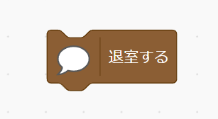

現在入室している部屋から退出します。  

### 入・退室したとき
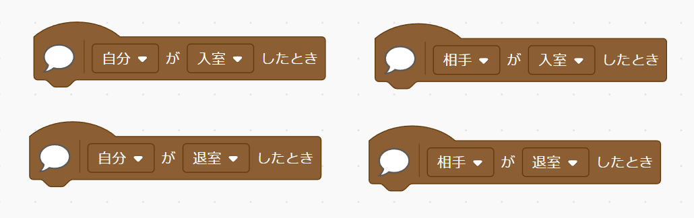

自分・相手が、入室・退室したときの合計４通りの事象に対してトリガをかけることができます。相手が退室したのトリガが発行されるのは、部屋にいる自分以外の全員がいなくなった時となるため、誤って３か所から入室してしまっている場合など、ご注意ください。  

### APIキー登録
> **Warning**  
> こちらは、[Esheepicques.js](./dist/Esheepicques.js)のライブラリにのみ含まれるブロックで、通常は使いません。

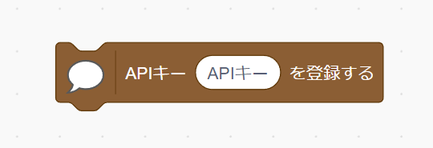

引数にAPIキーのテキストを入れて実行すると、APIキーの登録ができます。

## テキスト送付に関するブロック
### チャットテキスト送信


引数のテキストを相手に送ることができます。相手が入室していない場合はテキストは捨てられます。

## テキスト受け取りに関するブロック
### 受け取ったテキスト
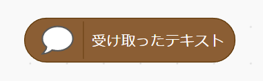

相手が送信したテキストを確認することができます。次の送信が発生すると上書きされます。

### チャットテキストを受け取ったとき
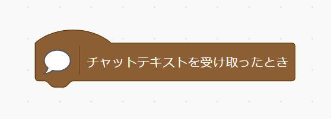

相手がテキストを送信した際にトリガがかかります。これをトリガに受け取ったテキストを処理するのがセオリーです。

</details>

# License⚖️
Copyright (c) 2023 [Tetsunori Nakayama](https://github.com/tetunori). MIT License.

# Reference📖
- [scratch-extension-gamepad](https://github.com/eqot/scratch-extension-gamepad) by [eqot](https://github.com/eqot). MIT License.  
- [E羊icques](https://github.com/SheepTester/scratch-gui) by [SheepTester](https://github.com/SheepTester). BSD 3-Clause "New" or "Revised" License.  
- [TurboWarp](https://github.com/TurboWarp) repositories. MIT License and BSD 3-Clause "New" or "Revised" License.  

