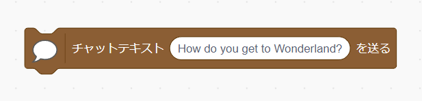

# Text chat VP Extension with SkyWay


Version 0.5.0   

# Description | 説明
Simple 1-on-1 Text Chatting extension for VP with [SkyWay](https://skyway.ntt.com/ja/) by NTT.  
NTTの[SkyWay](https://skyway.ntt.com/ja/)を使ったVisual Programming向けのシンプルな2者間テキストチャット機能拡張モジュールです。 
> **Warning**  
> We are using old version of SkyWay.  
> 旧版のSkyWayを使っています。[最新版](https://skyway.ntt.com/ja/)ではないのでご注意ください。

# How to Use | 使い方
## 1. Get API Key | APIキーを取得する
[こちらの手順](./api-key.md)で旧版SkyWayのAPIキーを取得してください。  
以下のようなIDのテキストが取得できますので、コピペできるようにご準備ください。
```
// API Key
12345678-abcd-ef12-3456-7890abcdef01
```

## 2. Load extension | 拡張機能をロードする
以下のURLにある`js`ファイルを拡張機能として登録してください。
```
https://tetunori.github.io/vp-ext-textchat-skyway/dist/index.js
```
最初にAPIキーを入力するプロンプトが出るので、上記手順1.でコピーしたAPIキーを貼り付けて、`OK`ボタンを押してください。  


> **Note**  
> ここで誤ってプロンプトをキャンセルしたりてしまっても、後ほど入室時に再度入力できますので、ご安心下さい。なお、誤ったAPIキーを入力してしまった場合は、ページを更新して再度入力をやり直してください。

ブロックカテゴリの一番下に"チャット"が表示されれば、準備完了です。  


> **Note**  
> なお、拡張機能の登録方法はツール毎に異なるため、各サイトの指示に従ってください。  
``や``については、以下の手順説明もご参照ください。🌟

## 3. Chatting | チャットをする
Alice/Bobの２人でチャットをする流れとしては、以下の通りです。(Alice/Bobが逆の場合も2, 3と同様です)
1. 双方で同じ部屋番号を指定して入室する
2. Aliceからチャットテキストを送る
3. Bobが受け取ったテキストを確認する

### 3-1. 入室する
AliceとBobの双方で、`部屋番号 <部屋番号テキスト> に入室する`ブロックの`<部屋番号テキスト>`部分を選択肢から選ぶか、お好きな文字を入力して、ブロックを実行してください。  


### 3-2. テキストを送る
双方で入室ができたら、AliceからBobにチャットテキストを送ってみましょう。  
Aliceのスクリプトの中で、`チャットテキスト <テキスト> を送る`ブロックの`<テキスト>`部分にお好きな字を入力して、ブロックを実行してください。  


### 3-3. 受信したテキストを見る
上記で送信が成功していれば、Bob側のスクリプトで`受け取ったテキスト`ブロックを実行すると、受信したテキストを確認することができます。  
また、`チャットテキストを受け取ったとき`と組み合わせると使いやすくなります。


Bob → Aliceについても同様に対応することで、双方向通信を実現することができます。以下のサンプルで確認してみましょう。

# Samples | サンプル
## Chatting application | チャットアプリ


|  Type  |  A-side  |  B-side  |  Note  |
| :---: | :---: | :---: | :---: |
| Standard ver. | [sample1-A.sb3](./sample/sample1-A.sb3) | [sample1-B.sb3](./sample/sample1-B.sb3) |  |
| No prompt ver. | [sample2-A.sb3](./sample/sample2-A.sb3) | [sample2-B.sb3](./sample/sample2-B.sb3) | Need [this lib](https://github.com/tetunori/vp-ext-textchat-skyway/blob/main/dist/Esheepicques.js) |

APIキー入力後、緑の旗を押してください。その後は好きにチャットできる仕様です。

# Blocks | ブロック詳細仕様
## 入/退室 関連ブロック
## テキスト送付ブロック
## テキスト受け取り時のブロック
## 


# License⚖️
Copyright (c) 2023 [Tetsunori Nakayama](https://github.com/tetunori). MIT License.

# Reference📖
[scratch-extension-gamepad](https://github.com/eqot/scratch-extension-gamepad) by [eqot](https://github.com/eqot). MIT License.
