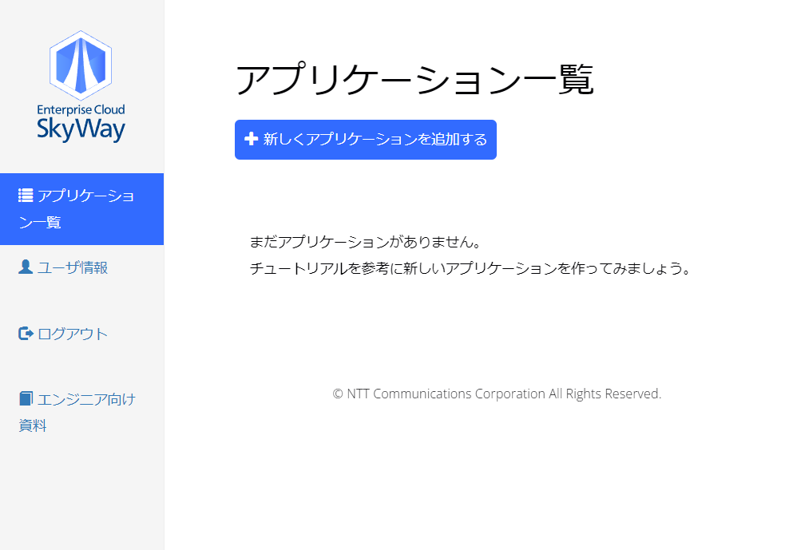

# 旧版SkyWayでの1キーの取得方法

## 1. (初回のみ)Community Edition（無料版）に登録する
[登録ページ](https://console-webrtc-free.ecl.ntt.com/users/registration)へアクセスして、メールアドレス・パスワードを登録しアカウントを作成します。  
しばらくすると登録したメールアドレス宛てに、本登録のURLが送られてくるので、そこにアクセスすると登録完了です。

## 2. SkyWayにログインする
[ログインページ](https://console-webrtc-free.ecl.ntt.com/users/login)へアクセスし、上記作成したアカウントでログインします。  

## 3. アプリケーションを追加する
`新しくアプリケーションを追加する`のボタンを押して、アプリケーション作成画面を表示します。  
  

以下の通り入力してください。  

- アプリケーション説明文
  - 適当な文字列でOKです。
- 利用可能なドメイン名
  - extensionを組み込むドメイン名を記載します。たとえば `*.github.io` のように設定可能です。

- 権限
  - `TURNを利用する`は有効にしておいてください。

※ なお、これらの設定は後でも変更が可能です。

上記設定を書き終わったら、`アプリケーションを作成する`ボタンを押してください。  

## 4. APIキーを確認する
アプリケーション一覧の画面に戻ると、先ほど作成したアプリケーションが追加されているはずです。  
赤枠で囲った部分がAPIキーとなります。

